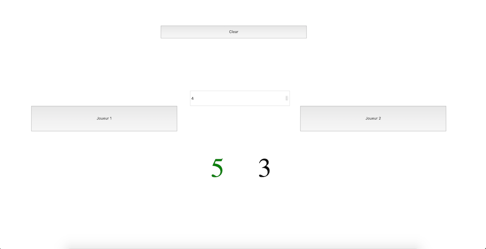

# Livraison 6 / ScoreKeeper(dans le cadre d'un ecercice pour la formation) niveau 2mois sur 8mois de formation

Le but de l'exercice etait de crée un ScoreKeeper uniquement en vanilla JS sans framework qui ajouter a chaque click sur un joueur 1 point supplementaire.
Le score doit se stoper a 5 maximum
Mes sources d'info : https://javascript.info/
****

